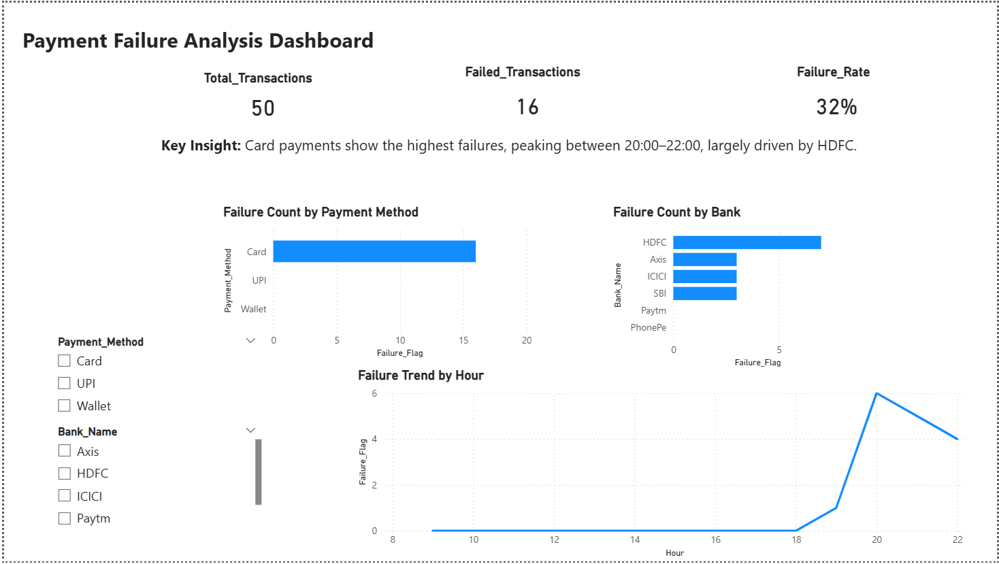

# Payment Failure Analysis Dashboard

## 📊 Project Overview
This project analyzes payment transaction failures using Power BI. The goal is to identify patterns across payment methods, banks, and time to improve transaction success rates and user experience.

---

## 💼 Business Problem
Online payment systems often experience transaction failures due to bank declines, network issues, or payment method limitations.  
Understanding where and when failures occur helps improve payment success rates, reduce user friction, and enhance system reliability.

---

## 🛠 Tools Used
- Power BI (Data visualization & dashboarding)
- Microsoft Excel (Data preparation & dataset creation)

---

## ⚙️ Process
- Created a structured dataset of payment transactions in Excel  
- Cleaned and prepared data for analysis  
- Imported dataset into Power BI  
- Built key measures (Total Transactions, Failed Transactions, Failure Rate)  
- Designed an interactive dashboard with charts and slicers  
- Analyzed failure patterns across payment methods, banks, and time  

---

## 🔍 Key Insights
- Card payments show the highest number of failures compared to UPI and Wallet  
- HDFC bank contributes the highest share of failed transactions  
- Payment failures peak during evening hours (20:00–22:00)  

---

## 📈 Dashboard Features
- KPI metrics (Total Transactions, Failed Transactions, Failure Rate)  
- Failure analysis by payment method and bank  
- Time-based trend analysis (hourly failures)  
- Interactive slicers for filtering  

---

## 📁 Files
- `Payment_Failure_Analysis_dashboard.pbix` → Power BI dashboard  
- `Payment_Failure_Dataset.xlsx` → Dataset used for analysis  
- `payment_failure_dashboard.png` → Dashboard screenshot

- ## 📸 Dashboard Preview

